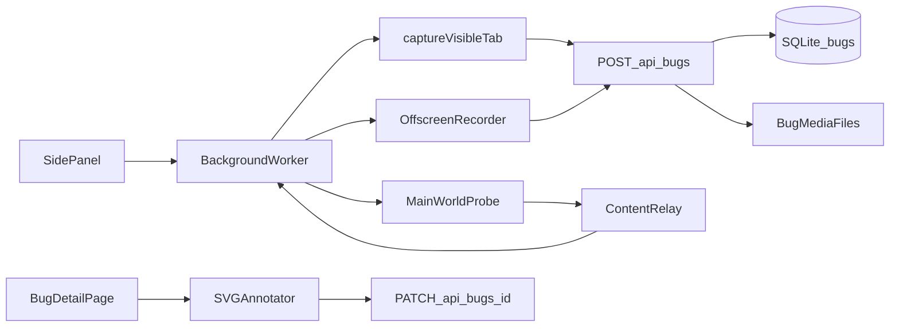

# Bug Capture, Annotation, and Tracking

Retrace now includes a Jam-inspired bug capture flow for screenshots and tab recordings. Jam's public product and documentation describe a useful baseline: visual capture, automatic repro steps, console logs, network logs, URL/device metadata, and annotation tools all bundled into a shareable report. Retrace implements the same core model locally for the extension and web app.

Sources:

- https://jam.dev/
- https://jam.dev/docs/introduction

## User Flow

1. Open the extension side panel on an HTTP or HTTPS tab.
2. Use **Capture screenshot** or **Record tab** in the Report a bug section.
3. Retrace collects page context while the media is captured.
4. The extension uploads the media and context to `POST /api/bugs`.
5. The web app opens `/bugs/[id]`; screenshots open the annotation modal automatically.
6. Bugs remain tracked under `/bugs` with status filters and detail pages.

## Architecture



## Captured Context

The extension installs a main-world probe with `chrome.scripting.executeScript` so it can observe the page runtime instead of the extension isolated world.

Captured data:

- Console: `console.log`, `console.info`, `console.warn`, `console.error`, `window.onerror`, and unhandled rejections.
- Network: `fetch`, `XMLHttpRequest`, and recent `performance.getEntriesByType("resource")` entries.
- Events: click, double-click, input, and change events with lightweight descriptions.
- Metadata: URL, title, timestamp, user agent, platform, language, viewport, and screen size.

Ring buffers keep the last 200 entries for each high-volume collection.

## Storage

Media files are stored under:

`~/.pwrec/bugs/[bug-id]/media.png` or `media.webm`

Bug rows are stored in SQLite:

- `id`
- `title`
- `description`
- `kind`: `screenshot` or `recording`
- `media_path`
- `annotations`
- `status`: `open`, `in_progress`, or `resolved`
- `page_url`
- `context`
- `created_at`
- `updated_at`

## API

`POST /api/bugs`

Multipart form upload:

- `kind`: `screenshot` or `recording`
- `title`: optional bug title
- `pageUrl`: captured URL
- `context`: JSON `BugContext`
- `media`: PNG or WebM file

`GET /api/bugs`

Returns all bugs sorted newest first.

`GET /api/bugs/[id]`

Returns a single bug row.

`PATCH /api/bugs/[id]`

Updates `title`, `description`, `status`, or `annotations`.

`DELETE /api/bugs/[id]`

Deletes the DB row and local media directory.

`GET /api/bugs/[id]/media`

Streams the captured screenshot or recording.

## Annotation Model

Annotations are stored as JSON so they remain editable:

```json
{
  "version": 1,
  "shapes": [
    {
      "id": "uuid",
      "type": "rect",
      "x": 120,
      "y": 160,
      "width": 300,
      "height": 120,
      "color": "#ef4444",
      "strokeWidth": 5
    }
  ]
}
```

Supported screenshot tools:

- Rectangle
- Ellipse
- Arrow
- Freehand pen
- Highlighter
- Text
- Undo
- Delete selected shape
- Download flattened PNG

## V1 Limitations

- Video recordings are view-only; shape annotations are screenshot-only.
- The network collector records metadata only, not request or response bodies.
- Browser-restricted pages such as `chrome://` cannot be captured or instrumented.
- Tab recording is WebM-first and does not capture tab audio in v1.
